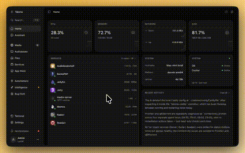

<p align="center">
  
</p>

<h1 align="center">Talome</h1>

<p align="center">
  <strong>An AI that manages your home server — and rewrites its own source code to get better at it.</strong>
</p>

<p align="center">
  220 purpose-built tools. 17 deep integrations. Autonomous monitoring that fixes problems at 3AM.<br/>
  The first home server that improves itself while you sleep.
</p>

<p align="center">
  <a href="LICENSE"></a>
  <a href="https://github.com/tomastruben/Talome/stargazers"></a>
  <a href="https://discord.gg/HK7gFaVRJ"></a>
  
</p>

<p align="center">
  <a href="https://talome.dev">Website</a> &middot;
  <a href="https://talome.dev/docs">Docs</a> &middot;
  <a href="#install">Install</a> &middot;
  <a href="#features">Features</a> &middot;
  <a href="https://discord.gg/HK7gFaVRJ">Discord</a>
</p>

```bash
curl -fsSL https://get.talome.dev | bash
```

<p align="center">
  
</p>

---

## What is Talome?

Every other home server platform is a passive tool — you install apps, you write the compose files, you debug the networking. Talome is different. It's a **reasoning system that lives on your machine**. One conversation can:

- **Install a full media stack** (Jellyfin + Sonarr + Radarr + Prowlarr + qBittorrent), wire them together, and hand you the URLs
- **Diagnose why a container is crashing** by reading logs, checking ports, and fixing config files
- **Create entirely new apps** from a natural language description
- **Rewrite its own source code** to fix bugs and add features — with automatic rollback if anything breaks
- **Monitor your server 24/7** — if a service goes down at 3AM, Talome diagnoses it, restarts it, and tells you what happened in the morning

No YAML. No config files. No SSH. One message away.

> **Public Alpha** — Under active development. Expect rough edges. [Join the Discord](https://discord.gg/HK7gFaVRJ) to report bugs and shape the roadmap.

## Why Talome?

- **AI-native, not AI-bolted-on.** The agent isn't a chatbot wrapper — it has 220 tools with deep access to Docker, networking, media APIs, and the filesystem. It doesn't suggest commands for you to run. It runs them.
- **Self-improving.** Talome reads its own TypeScript source, identifies improvements, writes the code, compiles, tests, and commits. If anything breaks, it rolls back. No other server platform does this.
- **Autonomous, not just reactive.** Three-layer monitoring catches problems in under 60 seconds, triages severity with a fast model, then dispatches a reasoning model to actually fix things. You wake up to a summary, not a page.
- **Truly open source.** AGPL-3.0. Not "source available." Not "community edition with the good stuff locked behind a license." The whole thing.

## Install

**Linux / macOS:**

```bash
curl -fsSL https://get.talome.dev | bash
```

The installer downloads Node.js, clones the repo, builds, and starts Talome as a native service. Open `http://localhost:3000` when it's done.

**Requirements:** macOS 12+ or Linux (Ubuntu 20.04+, Debian 11+, Fedora 38+, Arch, Raspberry Pi OS Bookworm 64-bit). 2 GB RAM, 5 GB disk. Docker (for managed apps — OrbStack recommended on Mac). Bring your own [Anthropic API key](https://console.anthropic.com/).

**Windows:** not supported natively in v0.1. Use WSL2 with Ubuntu 22.04 and run the Linux installer inside it.

**Why native instead of Docker?** Talome's self-evolution — the assistant reading its own source, proposing improvements, and applying them with typecheck + rollback — needs a writable source tree and a real `.git` directory. Running Talome inside a container breaks that. Talome *uses* Docker to run the apps you install *through* Talome, it just doesn't run inside one.

<details>
<summary>Manual install</summary>

```bash
git clone https://github.com/tomastruben/Talome.git ~/.talome/server
cd ~/.talome/server
pnpm install && pnpm build
cp .env.example apps/core/.env  # edit with your TALOME_SECRET
./apps/core/node_modules/.bin/tsx scripts/supervisor.ts
```

</details>

<details>
<summary>Update to latest</summary>

```bash
curl -fsSL https://get.talome.dev | bash -s -- update
```

</details>

## Features

- **Conversational control** — talk to your server in plain English. Install apps, read logs, manage downloads, troubleshoot problems. It remembers your preferences.
- **Self-evolution** — reads its own TypeScript source, writes improvements, compiles, commits. Automatic rollback if anything breaks.
- **Autonomous monitoring** — three-layer intelligence catches problems in <60s, triages, fixes, and sends you a morning summary.
- **App store** — unified store combining CasaOS, Umbrel, and your own apps. One-click install.
- **App creation** — describe what you want, get a complete Docker app (compose, config, manifest, optional web UI).
- **Media management** — Continue Watching, cinema mode, inline Jellyfin player with seek thumbnails and chapter markers.
- **Dashboard** — drag-and-drop widget grid, 20+ widgets, dark mode, fully responsive.
- **Automations** — trigger-based workflows with AI reasoning steps, cron scheduling, full run history.
- **Networking** — Caddy reverse proxy with auto Let's Encrypt TLS, CoreDNS + mDNS, Tailscale integration.
- **Backups** — volume snapshots, scheduled backups, retention policies, live progress.
- **File browser** — inline video/audio/image preview, code syntax highlighting, multi-drive support.
- **System monitoring** — CPU, memory, disk, network, SMART health, GPU (NVIDIA + AMD), per-container tracking.

### Deep Integrations

| | | | |
|---|---|---|---|
| Plex | Jellyfin | Sonarr | Radarr |
| Prowlarr | qBittorrent | Overseerr | Audiobookshelf |
| Pi-hole | Vaultwarden | Home Assistant | Ollama |
| Readarr | AdGuard Home | Memos | Dockge |

## Architecture

```
apps/core/          Hono backend — AI agent, 220 tools, Docker API, SQLite
apps/dashboard/     Next.js 16 frontend — dashboard, chat, app store
apps/web/           Documentation and marketing website
packages/types/     Shared TypeScript types
```

| Layer | Stack |
|---|---|
| Frontend | Next.js 16, React 19, Tailwind CSS 4, shadcn/ui |
| Backend | Hono, Vercel AI SDK, Anthropic Claude |
| Database | SQLite + Drizzle ORM |
| Validation | Zod everywhere |
| Runtime | Node.js 22, Docker |
| Monorepo | pnpm workspaces + Turborepo |

### Tool Domains

Tools are organized into domains that activate based on what you have installed:

| Domain | Activates when |
|---|---|
| Core | Always |
| Media | Sonarr or Radarr configured |
| Arr | Any arr app configured |
| qBittorrent | qBittorrent configured |
| Jellyfin | Jellyfin configured |
| Plex | Plex configured |
| Overseerr | Overseerr configured |
| Home Assistant | Home Assistant configured |
| Pi-hole | Pi-hole configured |
| Audiobookshelf | Audiobookshelf configured |
| Vaultwarden | Vaultwarden configured |
| Ollama | Ollama reachable |
| Optimization | Media stack configured |
| Proxy | Caddy reverse proxy enabled |
| Tailscale | Tailscale installed |
| mDNS | mDNS enabled |
| Setup | First-run wizard |

### MCP Server

Talome includes a Model Context Protocol server. Claude Code sessions get full access to every tool — Docker management, app installation, system diagnostics — directly from your terminal. The MCP server auto-syncs with the tool registry; no extra configuration needed.

## Development

```bash
# Clone and install
git clone https://github.com/tomastruben/Talome.git
cd talome
pnpm install

# Start in build mode (supervisor manages core + dashboard)
pnpm start

# Or start dev servers individually
pnpm dev

# Type check
pnpm typecheck

# Build for production
pnpm build
```

### Environment

Copy `.env.example` to `.env` and set your `ANTHROPIC_API_KEY`. Everything else has sensible defaults.

```bash
cp .env.example .env
# Edit .env and add your Anthropic API key
```

## Security

- AES-256-GCM encryption for all stored API keys and tokens
- Session-based JWT authentication with RBAC
- bcrypt for user and terminal-daemon passwords, constant-time comparison
- Rate limiting on API, chat, webhook, MCP, and terminal auth endpoints
- CSRF protection via Origin/Sec-Fetch-Site validation
- CORS locked to loopback, RFC1918, Tailscale (100.64/10), and explicit `DASHBOARD_ORIGIN`
- Content Security Policy, X-Frame-Options, HSTS in production
- Zod validation on all API inputs
- Terminal daemon binds to `127.0.0.1` by default
- Docker socket never exposed to the frontend
- Custom AI-authored tools disabled by default (opt-in via `TALOME_ENABLE_CUSTOM_TOOLS=true`)
- Automatic daily SQLite snapshots to a separate volume
- Full disclosure process in [SECURITY.md](SECURITY.md)

## How It Compares

| | Talome | CasaOS | Umbrel | TrueNAS | Unraid |
|---|---|---|---|---|---|
| AI assistant | Yes | No | No | No | No |
| Self-improving | Yes | No | No | No | No |
| App creation via chat | Yes | No | No | No | No |
| Autonomous monitoring | Yes | No | No | No | No |
| Memory system | Yes | No | No | No | No |
| Open source | AGPL-3.0 | Apache-2.0 | PolyForm NC | GPL-3.0 | No |
| One-command install | Yes | Yes | Yes | No | No |
| Multi-source app store | Yes | Partial | No | No | Yes |
| Built-in reverse proxy | Yes | No | No | Yes | No |
| Media player | Yes | No | No | No | No |
| Mobile responsive | Yes | Yes | Yes | No | Partial |

## Contributing

Talome is open source and contributions are welcome. See [CONTRIBUTING.md](CONTRIBUTING.md) to get started, and [CLAUDE.md](CLAUDE.md) for the full architecture guide and coding conventions.

## Community

- **Discord:** [discord.gg/HK7gFaVRJ](https://discord.gg/HK7gFaVRJ) — bug reports, feature requests, show off your setup
- **Discussions:** [GitHub Discussions](https://github.com/tomastruben/Talome/discussions)

## License

[AGPL-3.0-or-later](LICENSE)

Talome is a server management tool. It does not host, distribute, or provide access to any media content. Users are solely responsible for ensuring that all content managed through Talome is obtained and used in compliance with applicable laws and the terms of service of any third-party applications.

All product names, logos, and trademarks shown in screenshots and demo videos belong to their respective owners. Their use is for demonstration purposes only and does not imply endorsement or affiliation.

---

<p align="center">
  Built by <a href="https://github.com/tomastruben">Tomas Truben</a>.<br/>
  <strong>Your server, one message away.</strong>
</p>
